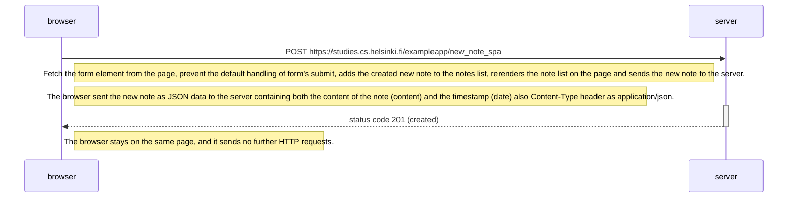

```mermaid
sequenceDiagram
    participant browser
    participant server

    browser->>server: POST https://studies.cs.helsinki.fi/exampleapp/new_note_spa

    Note right of browser: Fetch the form element from the page, prevent the default handling of form's submit, adds the created new note to the notes list, rerenders the note list on the page and sends the new note to the server.

    Note right of browser: The browser sent the new note as JSON data to the server containing both the content of the note (content) and the timestamp (date) also Content-Type header as application/json.

    activate server
    server-->>browser: status code 201 (created)
    deactivate server

    Note right of browser: The browser stays on the same page, and it sends no further HTTP requests.


```
